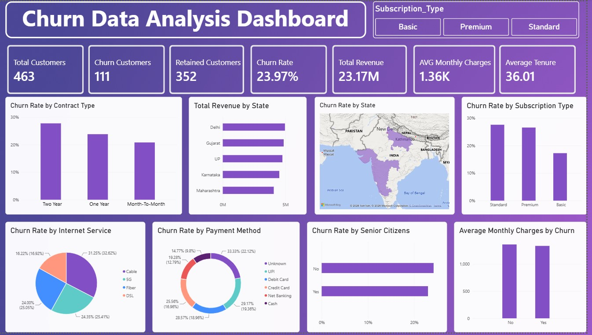

# Customer Churn Analysis — Excel, Python, MySQL, SQL & Power BI

An end-to-end customer churn analysis project covering data cleaning, feature engineering, database integration, SQL analysis, and interactive dashboard development.

The project uses Python (Pandas) to clean and transform customer data, MySQL to store and query the processed dataset, and Power BI to visualize churn patterns and business insights through a live database connection.

## Dashboard Overview



The Power BI dashboard provides an overview of customer churn, revenue, and customer characteristics through interactive KPIs, charts, and a geographic revenue map.

## Business Questions

- What is the overall customer churn rate?
- Which contract and subscription segments have the highest churn rates?
- How does churn vary by internet service and payment method?
- Does senior citizen status relate to differences in churn rates?
- How do average monthly charges compare between churned and retained customers?
- Which states generate the highest total revenue?

## Project Pipeline

### 1. Excel — Initial Data Review

- Reviewed the raw customer dataset.
- Performed initial data inspection and manual spot-checks.

### 2. Python (Pandas) — Data Cleaning & Feature Engineering

Performed data preparation and transformation using Pandas.

**Data cleaning:**

- Handled missing values using mode/mean imputation for selected fields.
- Removed records with missing values in the target `Churn` column, as the target cannot be reliably imputed.
- Removed duplicate records.
- Filtered invalid ages and retained customers within the 18–100 age range.
- Removed rows containing negative charge values.
- Standardized categorical text formatting.

**Feature engineering:**

- `Tenure_Group` — Categorized customers based on tenure.
- `Customer_Value` — Calculated as Monthly Charges × Tenure.
- `Churn_Flag` — Converted the `Churn` target into a binary 0/1 feature for analysis.

### 3. MySQL — Database Integration

- Created a `churndb` database.
- Loaded the cleaned dataset into MySQL using SQLAlchemy.
- Stored the processed customer data for downstream SQL analysis.

### 4. SQL — Business Analysis

Performed business-focused analysis directly against the MySQL database.

The SQL script includes queries for:

- Overall churn rate.
- Churn by contract type.
- Churn by state.
- Churn by payment method.
- Average monthly charges by contract.
- Top customer-value customers.
- Senior citizen churn analysis.
- Customers without tech support.

The SQL analysis script is available in [`ChurnDB.sql`](ChurnDB.sql).

### 5. Power BI — Dashboard Development

Connected Power BI to the MySQL database and developed an interactive dashboard using custom DAX measures.

The report uses a live connection to the MySQL database rather than a static file import.

## Data Dictionary

The following table highlights the main fields used in the analysis.

| Column | Description |
|---|---|
| `Customer_ID` | Unique identifier for each customer |
| `Churn` | Indicates whether the customer churned (`Yes`/`No`) |
| `Churn_Flag` | Binary churn indicator: 1 = Churned, 0 = Retained |
| `Contract_Type` | Customer contract duration/type |
| `Subscription_Type` | Customer subscription tier |
| `Internet_Service` | Type of internet service used |
| `Payment_Method` | Customer payment method |
| `Senior_Citizen` | Indicates senior citizen status |
| `Monthly_Charges` | Customer's monthly subscription charge |
| `Tenure` | Duration of the customer relationship |
| `Tenure_Group` | Categorized tenure range |
| `Customer_Value` | Calculated customer value: Monthly Charges × Tenure |
| `State` | Customer's geographic state |
| `Customer_Name` | Customer name |
| `Age` | Customer age |

## Dashboard Features

- **7 KPI cards:** Total Customers, Churn Customers, Retained Customers, Churn Rate, Total Revenue, Average Monthly Charges, and Average Tenure.
- Churn rate by Contract Type, State, Subscription Type, Internet Service, and Payment Method.
- Average Monthly Charges by churn status.
- Geographic revenue map.
- Interactive Subscription Type slicer.
- Custom DAX measures for churn and customer metrics.

Churn rate is calculated as:

**Churn Rate = Churned Customers ÷ Total Customers**

This allows fair comparison between customer segments of different sizes.

## Key Findings

### 1. Contract Type

Two Year contracts recorded the highest churn rate in this dataset at approximately 27%, followed by One Year contracts at 23% and Month-to-Month contracts at 20%.

This result is counter to the common assumption that longer contracts always reduce churn. The segment sizes and customer characteristics should be considered before drawing conclusions.

### 2. Monthly Charges

Churned customers had slightly higher average monthly charges than retained customers, but the gap is small — suggesting pricing is a weak churn signal in this dataset.

### 3. Senior Citizen Status

Senior citizen groups showed relatively similar churn rates in this dataset, suggesting that senior citizen status alone may not be a strong differentiator of churn.

### 4. Geographic Revenue

Revenue was concentrated in the highest-performing states, providing a geographic view of customer revenue distribution.

## Tools & Technologies

- Excel
- Python (Pandas)
- MySQL
- SQL
- SQLAlchemy
- Power BI
- DAX

## Project Structure

## Project Structure

```text
Customer Churn Analysis/
│
├── .env
├── .gitignore
├── Churn_Data_Analysis_Dashboard.jpg
├── Churn_Data_Analysis_Dashboard.pbix
├── Churn_Dataset_Cleaning.ipynb
├── ChurnDB.sql
├── Clean_Churn_Data.csv
├── README.md
└── Unclean_Churn_Data.xlsx
```

## Project Goal

To develop practical, end-to-end data analytics skills by working through the complete workflow of data preparation, database integration, SQL analysis, and business intelligence dashboard development.